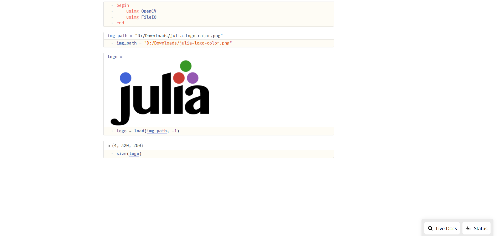

# Reading and Writing of Images

OpenCV provides a wide range of functions for image processing, including reading and writing images.

OpenCV.jl provides 2 ways to read and write images
1. OpenCV native api
2. FileIO.jl api

OpenCV provides `imread` and `imwrite`, while FileIO privides `load` and `save` for similar functionalities


!!! note

    FileIO api not suppport all image formats currently but it support major formats.
    If FileIO api not works then use OpenCV native api

## Reading Images

```julia
using OpenCV

img_path = "/path/to/image"
img = OpenCV.imread(img_path)
```
with FileIO
```julia
using OpenCV, FileIO

img_path = "/path/to/image"
img = load(img_path)
```

in both cases `img` has same data. Both methods accept same reading flags[^imreadflags].

```julia
using OpenCV

img_path = "/path/to/image"
flag = OpenCV.IMREAD_UNCHANGED 
img = OpenCV.imread(img_path, flag)
```
with FileIO
```julia
using OpenCV, FileIO

img_path = "/path/to/image"
flag = OpenCV.IMREAD_UNCHANGED 
img = load(img_path, flag)
```

## Writing Images
```julia
using OpenCV

img = rand(UInt8, 1000, 1000) |> OpenCV.Mat
img_path = "/path/to/image"
OpenCV.imwrite(img_path, img)
```
with FileIO
```julia
using OpenCV, FileIO

img = rand(UInt8, 1000, 1000) |> OpenCV.Mat
img_path = "/path/to/image"
save(img_path, img)
```

Both methods accept same writing flags[^imwriteflags].

```julia
using OpenCV

img = rand(UInt8, 1000, 1000) |> OpenCV.Mat
img_path = "/path/to/image"
flag = Int32[OpenCV.IMWRITE_JPEG_QUALITY, 100]
OpenCV.imwrite(img_path, img, flag)
```
with FileIO
```julia
using OpenCV, FileIO

img = rand(UInt8, 1000, 1000) |> OpenCV.Mat
img_path = "/path/to/image"
flag = Int32[OpenCV.IMWRITE_JPEG_QUALITY, 100]
save(img_path, img, flag)
```

## Displaying Images

When working with images, it's obviously helpful to be able to look at them. If you use Julia through Pluto, VSCode, or IJulia, images should display automatically.

Preview from Pluto.jl



`OpenCV.imshow` method display image on Qt window.


`Plots.jl` To-do

`Makie.jl` To-do

## Notes
[^imreadflags]: https://docs.opencv.org/4.x/d8/d6a/group__imgcodecs__flags.html#ga61d9b0126a3e57d9277ac48327799c80
[^imwriteflags]: https://docs.opencv.org/4.x/d8/d6a/group__imgcodecs__flags.html#ga292d81be8d76901bff7988d18d2b42ac